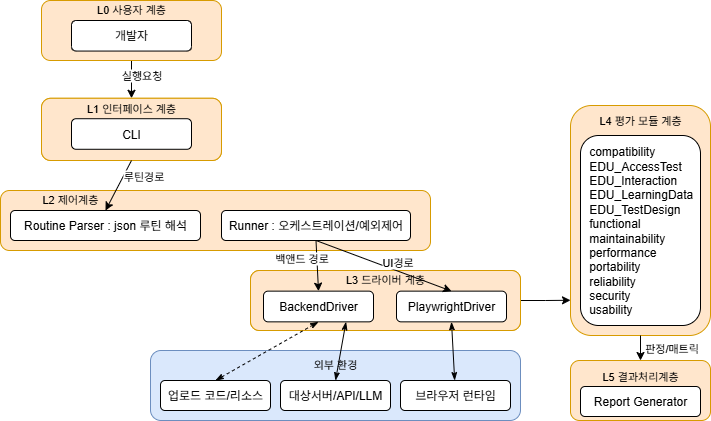

# EduTestSW 🧪  
**교육용 소프트웨어 품질 검사 자동화 도구**

## 📌 소개
EduTestSW는 **교육 소프트웨어(LMS/EBS 등)** 의 품질을 자동으로 평가하기 위한 오픈소스 프로젝트입니다.  
ISO/IEC 25010 품질 특성을 기반으로 **기능성, 신뢰성, 성능, 보안성, 사용성, 유지보수성, 이식성** 등을 자동 검사할 수 있도록 설계되었습니다.  


---

## ⚙️ 설치 방법

### 1. 가상환경 생성 및 활성화

```bash
# 가상환경 생성
python -m venv venv

# Windows
venv/Scripts/activate

# macOS/Linux
source venv/bin/activate
```

### 2. 필요 패키지 설치

```bash
pip install -r requirements.txt
```
npm install playwright
npx playwright install
---

## ▶️ 실행 방법

```bash
python run_routine.py
```

---

##📂 프로젝트 구조

EduTestSW/
├── run_routine.py # 실행 스크립트
├── src/
│ ├── assessments/ # 품질 특성별 검사 모듈
│ ├── core/ # 파서, 드라이버, 러너
│ └── routines/ # JSON 테스트 시나리오
├── requirements.txt # 의존성 패키지
└── README.md # 프로젝트 설명 문서

---

## 📊 아키텍처 다이어그램
<p align="center">
  
</p>

---

## 커밋 메세지 규칙

**feat**   새로운 기능에 대한 커밋

**fix**   버그 수정에 대한 커밋

**build**   빌드 관련 파일 수정 / 모듈 설치 또는 삭제에 대한 커밋

**chore**   그 외 자잘한 수정에 대한 커밋

**ci**   ci 관련 설정 수정에 대한 커밋

**docs**   문서 수정에 대한 커밋

**style**   코드 스타일 혹은 포맷 등에 관한 커밋

**refactor**   코드 리팩토링에 대한 커밋

**test**   테스트 코드 수정에 대한 커밋

**perf**  성능 개선에 대한 커밋
